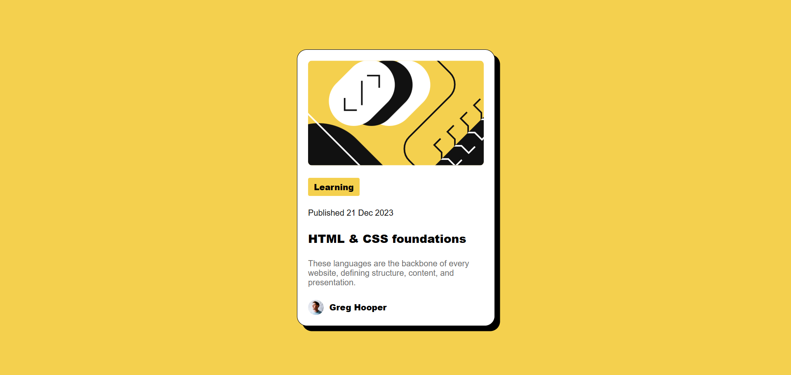

# Frontend Mentor - Blog preview card solution

This is a solution to the [Blog preview card challenge on Frontend Mentor](https://www.frontendmentor.io/challenges/blog-preview-card-ckPaj01IcS).

## Table of contents

- [Overview](#overview)
  - [Screenshot](#screenshot)
  - [Links](#links)
- [My process](#my-process)
  - [Built with](#built-with)
  - [What I learned](#what-i-learned)
  - [Continued development](#continued-development)
- [Author](#author)

## Overview

### Screenshot



### Links

- [Solution](https://www.frontendmentor.io/solutions/html5-css-custom-properties-flexbox-min-for-responsive-width-TkY3RDzrhk)
- [Live](https://blog-preview-card-psi-seven.vercel.app/)

## My process

### Built with

- Semantic HTML5 markup
- CSS custom properties
- Flexbox
- Mobile-first workflow

### What I learned

Removed fixed `height` from the card container and let content + `gap` define the height naturally. This was a recurring issue from previous builds — fixing it here means the card adapts to content instead of clipping or adding dead space.

```css
.container {
    display: flex;
    flex-direction: column;
    gap: 1em;
    /* no fixed height */
}
```

Used `min()` for responsive width without any media query — the card scales down on small screens automatically:

```css
.container {
    width: min(24em,90%);
}
```

Added `padding` to `main` as a safety net so the card never touches viewport edges on very small screens:

```css
main {
    min-height: 100vh;
    padding: 1rem;
}
```

### Continued development

- Practice hover and focus states — this challenge requires them but I haven't implemented them yet
- Keep avoiding fixed `height` on containers across all future builds
- Drill CSS Grid for more complex layouts (next challenge target)

## Author

- Frontend Mentor - [@bangarukondabollapally](https://www.frontendmentor.io/profile/bangarukondabollapally)
- GitHub - [@bangarukondabollapally](https://github.com/bangarukondabollapally)
